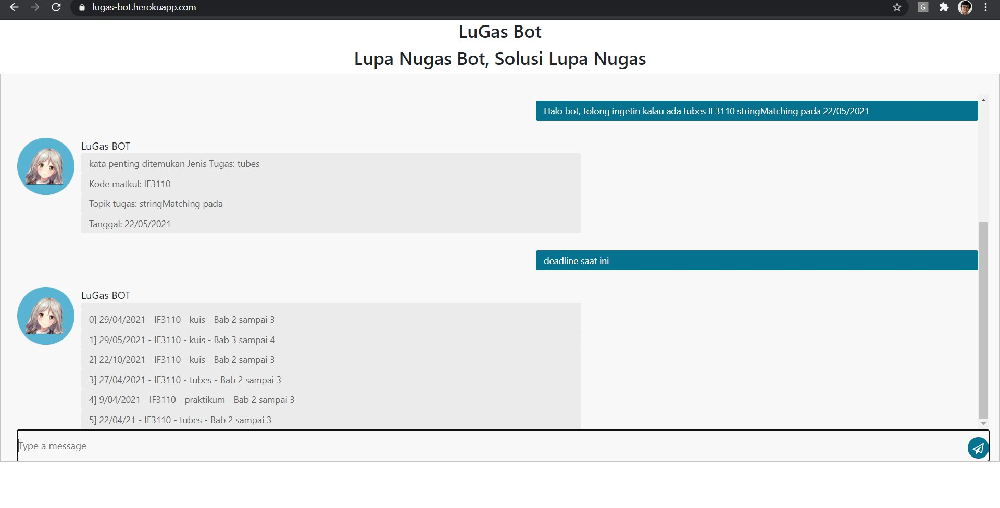
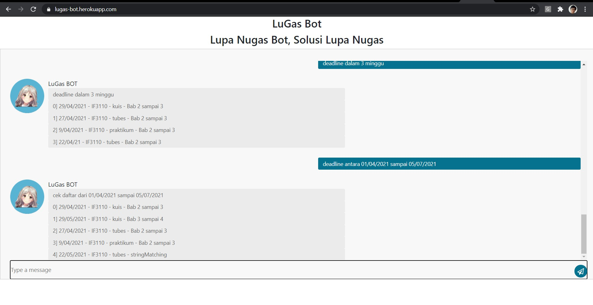
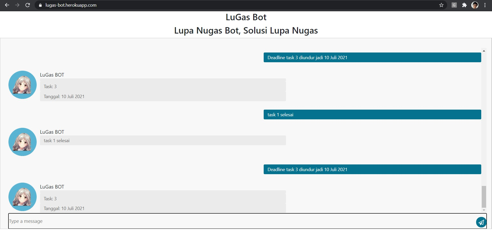

# LuGas Bot
> LuGas Bot kepanjangan dari Lupa Nugas BOT hasil dari project ini bisa dilihat pada  https://lugas-bot.herokuapp.com/

## Table of contents
* [General info](#general-info)
* [Screenshots](#screenshots)
* [Technologies](#technologies)
* [Setup](#setup)
* [Features](#features)
* [Status](#status)
* [Author](#author)

## General info
LuGas BOT adalah suatu program untuk menyimpan data tugas user memanfaatkan algoritma regex, dan boyer moore 

## Screenshots

## Technologies
* Node.js - v12.16.1
* Angular CLI - version 9.1.15
* nodemon - version 2.0.7 *optional

## Setup

* project link : https://lugas-bot.herokuapp.com/

* Setup using local client but deployed server
 - buka folder StringMatchingClientAngular pada folder src menggunakan terminal
 - jalankan perintah "ng serve --open" pada terminal tanpa menggunakan kutip
 - buka client pada browser dengan link http://localhost:4200/

* Setup using local server and local client
 - buka folder StringMatchingClientAngular pada folder src menggunakan terminal
 - buka file server-interface.service.ts pada folder src\StringMatchingCLientAngular\src\app\server-interface.service.ts
 - ubah line 9 dari "private url = "https://lugas-bot.herokuapp.com/"; " menjadi "private url  = "http://localhost:8080";" tanpa kutip
 - jalankan perintah "nodemon server" pada terminal tanpa menggunakan kutip
 - jalankan perintah "ng serve --open" pada terminal tanpa menggunakan kutip
 - buka client pada browser dengan link http://localhost:4200/

## Input Examples
Show examples of usage:
"Halo bot, tolong ingetin kalau ada kuis IF3110 Bab 2 sampai 3 pada 22/04/21"
"deadline saat ini"
"deadline dalam 3 minggu"
"deadline antara 01/04/2021 sampai 05/07/2021"
"task 1 selesai"
"Deadline Task 3 diundur jadi 10 Juli 2021"

## Features
1. Add task (mengimpan task pada database) \
2. Cek task (melihat daftar task berdasarkan kode pada database)\
3. Cek daftar task (melihat daftar task pada database) \
4. Update task (mengubah task pada database) \
5. Menandai task selesai (men delete task pada database)\
Cat : Untuk melihat atau mengubah harus menggunakan kata kunci deadline

## Status
Project is:  _finished_

## Author
- 13519008 / Ronggur Mahendra Widya Putra
- 13519052 / Syamil Cholid Abdurrasyid
- 13519184 / Muhammad Furqon
